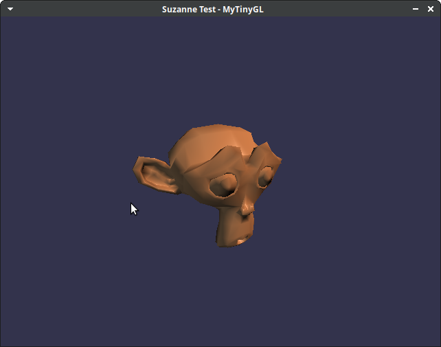

# MyTinyGL

A lightweight software OpenGL 1.x renderer. No GPU required.



## About the Development

I want to be transparent: this project was developed with the assistance of Claude (Anthropic's AI). I'm sorry if this wasn't clear from the start.

**What I'm doing about it:**
- I'm reviewing every single line of code myself
- The entire codebase passes a comprehensive test suite
- I'm committed to understanding every algorithm and design decision
- I will deliver a good and trustable contribution to the community

AI helped accelerate development, but the responsibility for this code is mine. I'm actively working to ensure this project meets the standards the community deserves.

## What is it?

MyTinyGL is a complete software implementation of the OpenGL 1.x fixed-function pipeline. It renders 3D graphics entirely on the CPU, producing pixel-perfect output without any GPU or hardware acceleration.

**~8,000 lines of clean C99. No dependencies.**

## Size Comparison

| Implementation | Lines of Code | Notes |
|----------------|---------------|-------|
| **MyTinyGL** | ~8,000 | Complete OpenGL 1.5 API |
| TinyGL | ~20,000 | Subset only, buggy, abandoned |
| Mesa (software) | 500,000+ | Full OpenGL, massive |

## Features

- Full OpenGL 1.5 immediate mode API
- Texturing with filtering and mipmaps
- Lighting (8 lights, Gouraud and Phong shading)
- Fog, blending, alpha test, depth test, stencil test
- Display lists, VBOs, vertex arrays
- Frustum clipping, perspective-correct interpolation
- Complete state query API (glGet*)

## Building

```bash
make
```

That's it. Pure C99, no dependencies.

For the testbed examples (optional):
```bash
sudo apt install libsdl2-dev
cd testbed && make
```

## Usage

```c
#include <mytinygl/sdl.h>

int main() {
    mtgl_init("My App", 800, 600);

    glClearColor(0.0f, 0.0f, 0.0f, 1.0f);
    glEnable(GL_DEPTH_TEST);

    while (running) {
        glClear(GL_COLOR_BUFFER_BIT | GL_DEPTH_BUFFER_BIT);
        // Draw your scene...
        mtgl_swap();
    }

    mtgl_destroy();
    return 0;
}
```

Link with: `-lMyTinyGL -lSDL2 -lm`

## License

MIT
